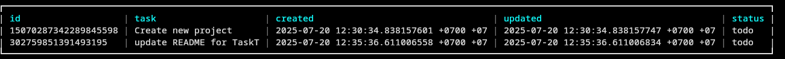

# TaskT

CLI task tracker for controlling your tasks without GUI
keeps tasks in JSON, controlled through intuitive commands




## Features
- ➕  Add new task with description
- ✏️ Update the description of an existing task.
- 📋  List all tasks
- 🗑️ Delete tasks
- 🏁 Update the status of a task

## Getting Started

### Installation
```
git clone https://github.com/headboot/task-tracker.git
cd task_tracker
go build -o taskt
```
### Usage
```bash
# add a task
./taskt add {taskname}

# list tasks
./taskt list

# update task
./taskt update {id} {new task name}

#mark task statu progress or done
./taskt mark-done {id} 
./taskt mark-progress {id}

# delete task
./taskt delete {id}

```

## License
This project is licensed under the MIT License — see LICENSE for details.